# 📱 EduCare - Preschool Management & Family Connection App

## 📖 Overview
**EduCare** is a comprehensive software solution designed for preschools to bridge the gap between schools and parents. The application empowers teachers to manage classes efficiently, track children's development, and allows parents to stay updated on their child's daily activities in the most visual way.

The project aims to **digitalize the traditional communication book**, applying visual charts for emulation assessment and student rewards.

## 🎨 UI/UX Design
Before coding, the project was meticulously designed for User Experience (UX) and User Interface (UI) on Figma.
👉 **[View Figma Design Prototype](https://www.figma.com/design/nVsy48N4UnYGURE0KDYno4/testing--Copy-?t=WAqcbmOUNn8WobWG-1)**

## ✨ Key Features

### 🧑‍🏫 For Teachers
* **Student Management:** View class lists, search details, and contact parents directly.
* **Digital E-Communication Book:** Daily assessment of students based on activities (Eating, Sleeping, Hygiene, Learning).
* **Reward System:** Award Stars ⭐, Flowers 🌸, and Badges 🏅 to students.
* **Visual Statistics:**
    * Pie Chart: Reward distribution.
    * Bar Chart: Student ranking by month/week.
* **Attendance:** Fast Check-in/Check-out system.

### 👨‍👩‍👧 For Parents
* **Activity Log:** View the child's daily activity timeline.
* **Health Tracking:** Update and monitor height, weight, and BMI.
* **Notifications:** Receive instant announcements from the school.
* **Live Camera:** View classroom activities (simulated).

### 🛠 For Admin
* **Class & Teacher Management:** Assign homeroom teachers and manage schedules.
* **Records Management:** CRUD operations for students and teachers profiles.
* **Financials:** Manage invoices and revenue statistics.

## 📸 Screenshots & Demo

### 🔐 Authentication & General
| **Login Screen** | **Registration** | **Forgot Password** |
|:---:|:---:|:---:|
| 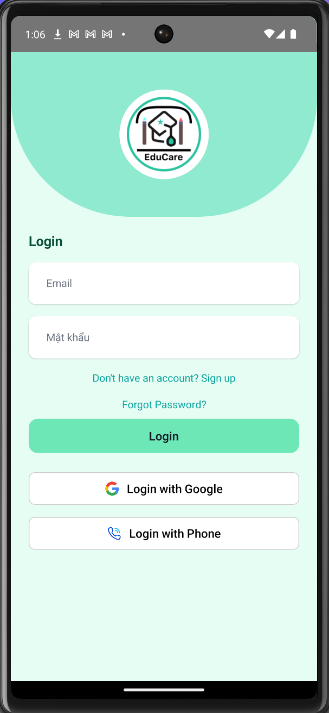 | 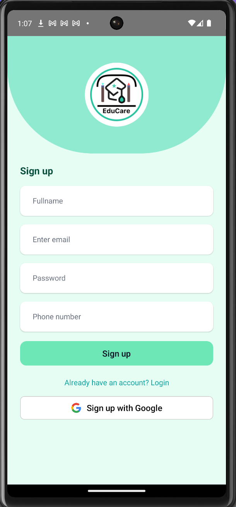 |  |
| *Secure Login* | *Create Account* | *Password Recovery* |

| **Home Screen** | **User Profile** | **Account Info** |
|:---:|:---:|:---:|
| 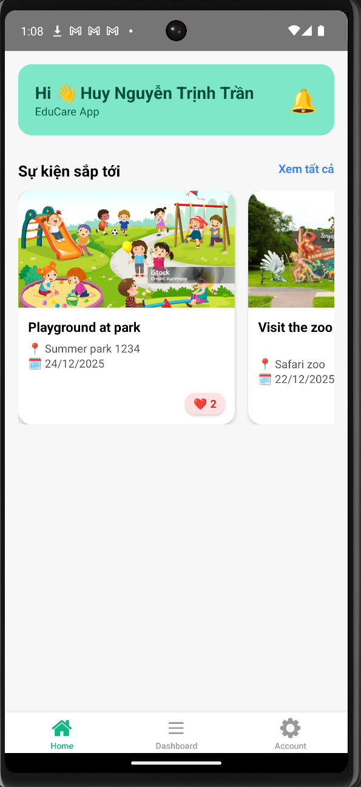 | 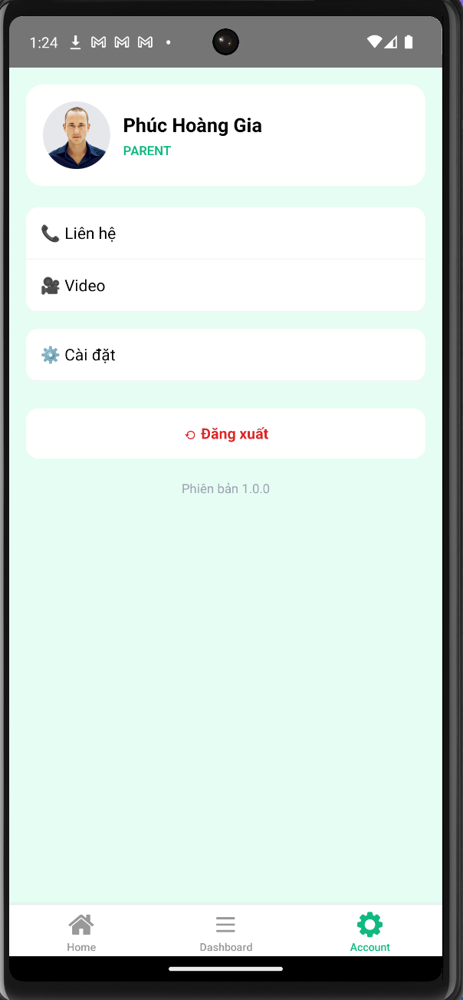 | 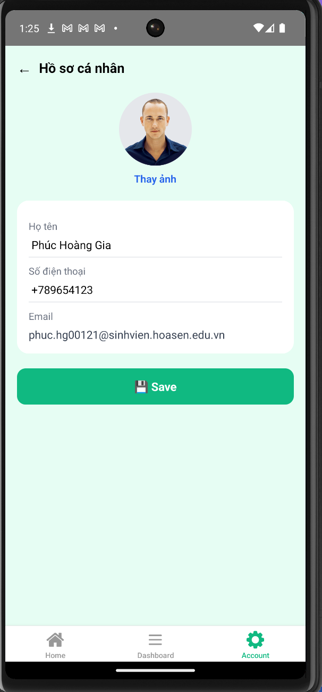 |
| *Main Dashboard* | *Profile Settings* | *Personal Details* |

### 🛠 Admin Portal
| **Admin Dashboard** | **Tuition & Invoices** | **Revenue Stats** | **Student List** | **Advanced Filter** |
|:---:|:---:|:---:|:---:|:---:|
| 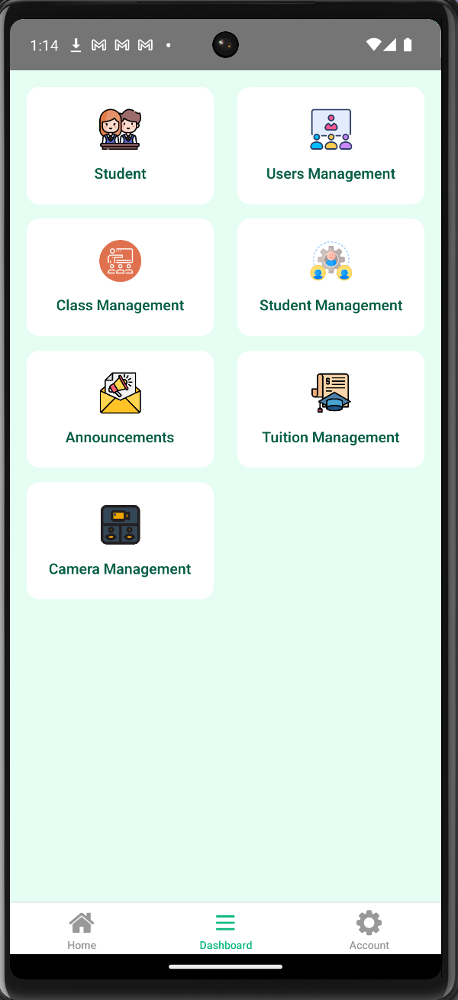 | 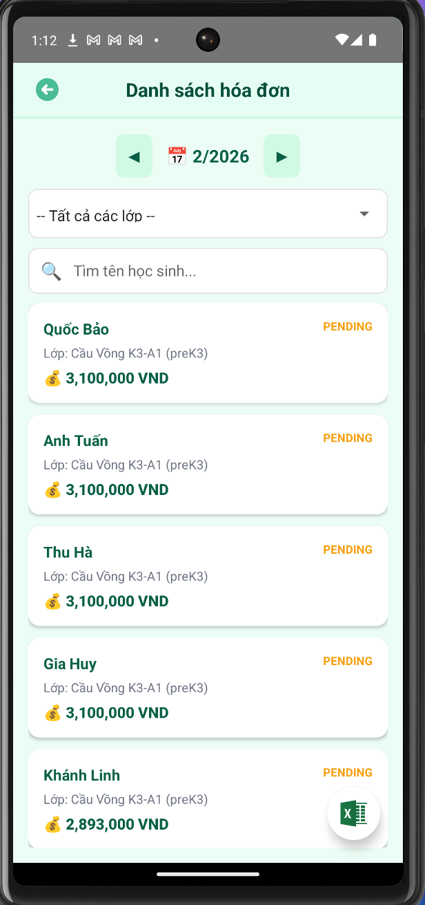 | 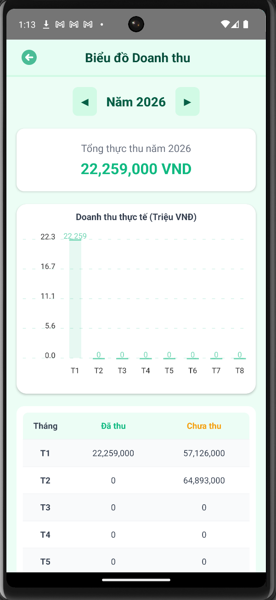 | 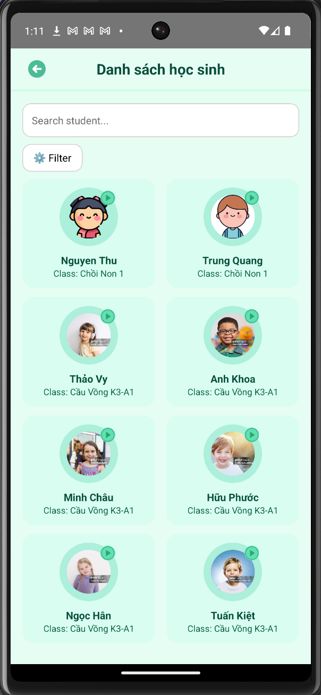 | 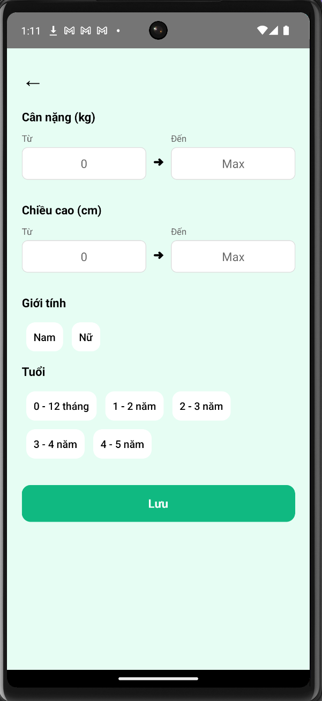 |
| *Overview* | *Payment Management* | *Financial Charts* | *Student Directory* | *Search & Filter* |

### 🧑‍🏫 Teacher Portal
| **Teacher Home** | **Attendance** | **Daily Feedback** | **Statistics** | **Activity Schedule** |
|:---:|:---:|:---:|:---:|:---:|
| 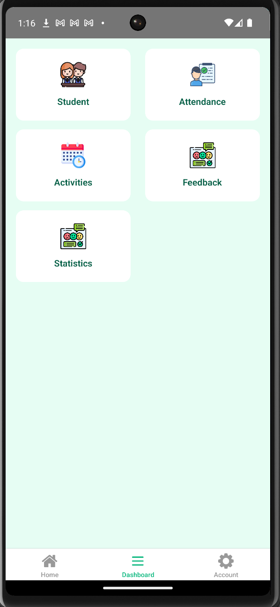 | 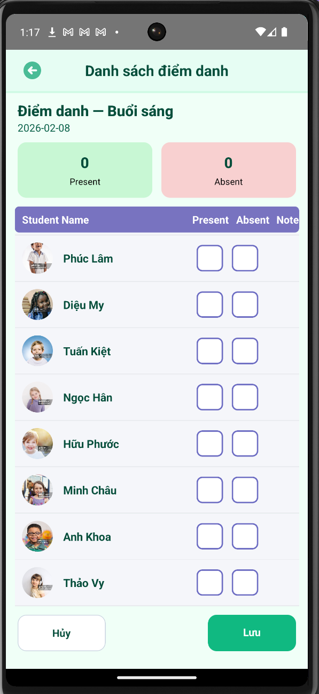 |  | 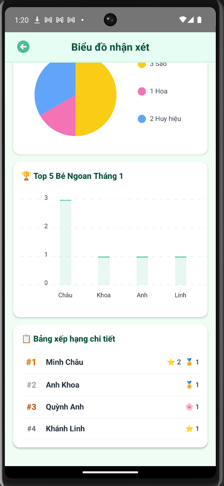 | 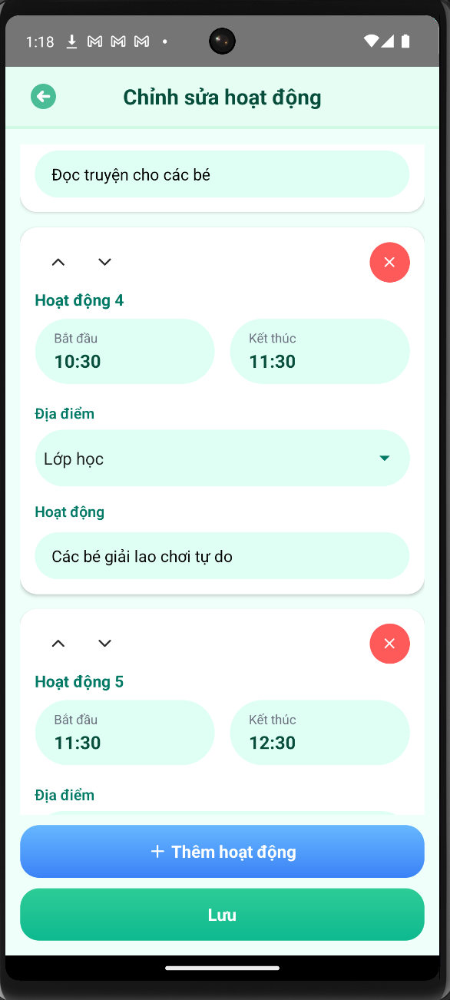 |
| *Quick Actions* | *Check-in/Out* | *Give Rewards* | *Ranking Charts* | *Daily Tasks* |

### 👨‍👩‍👧 Parent Portal
| **Notifications** | **Tuition Details** | **Live Class** | **Child Activities** | **Class Info** |
|:---:|:---:|:---:|:---:|:---:|
| 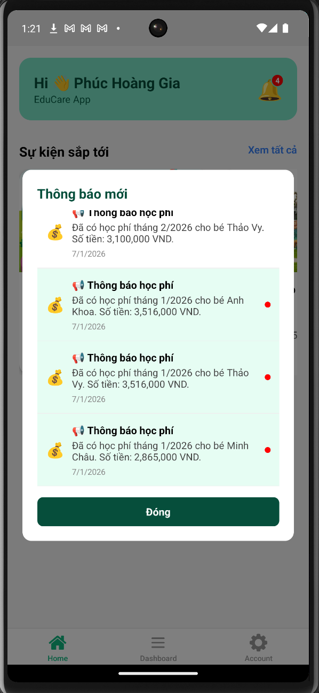 | 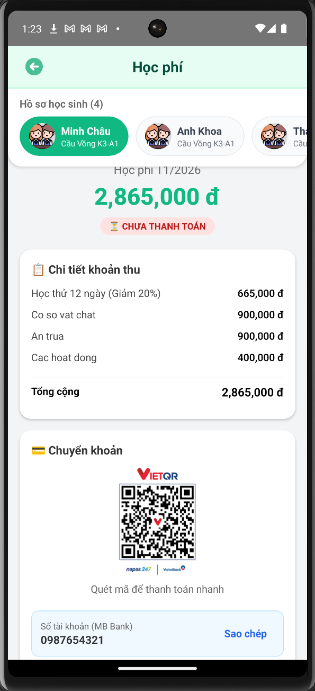 | 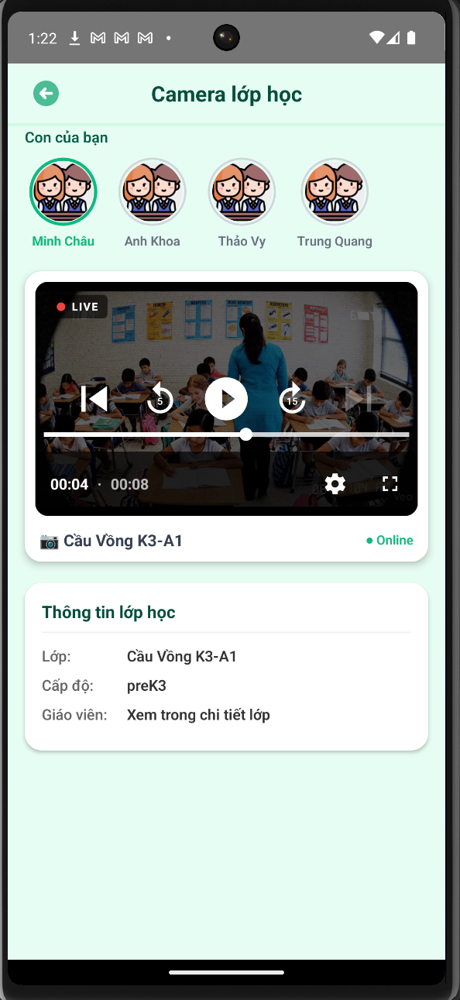 | 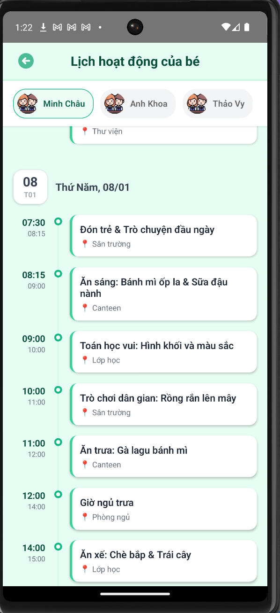 | 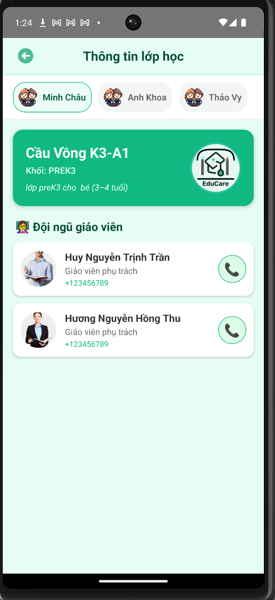 |
| *School Alerts* | *Payment Status* | *Camera Stream* | *Daily Timeline* | *Class Details* |

## 🚀 Tech Stack

The project is built on a modern **Full-stack JavaScript** architecture:

* **Mobile App:**
    * ⚛️ **React Native** (CLI)
    * 📘 **TypeScript** - Ensures type safety and code quality.
    * 📊 **React Native Chart Kit** - For visualizing statistics.
    * 📅 **React Native Calendars** - Scheduling and tracking.
    * 🔥 **Firebase Auth** - Secure user authentication.
* **Backend API:**
    * 🟢 **Node.js** & **Express.js** - High-performance REST API.
    * 🍃 **MongoDB** & **Mongoose** - Flexible NoSQL database.
    * 🔐 **JWT** - Secure API authorization.
* **Tools:**
    * 🎨 **Figma** - UI/UX Design & Prototyping.
    * 🐙 **Git/GitHub** - Version Control.
    * 📝 **Postman** - API Testing & Documentation.

## ✍️ Author
* **[Tran Huy]** - *Developer & Designer*

---
*Thank you for visiting EduCare!*
